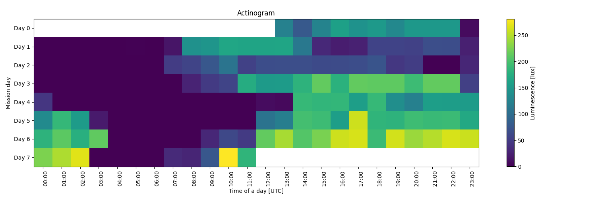
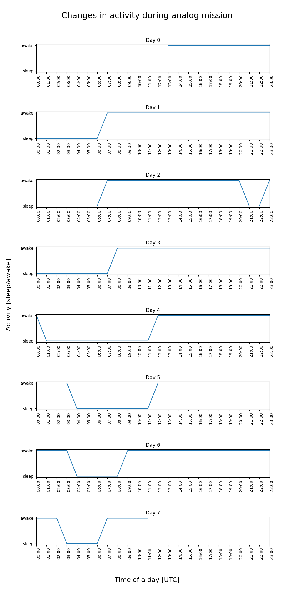

# Sensors

## Wstęp

Firma Analog Astronaut Training Center (AATC) organizuje symulacje misji
kosmicznych. Uczestnicy misji mieszkają w specjalnie przygotowanym
laboratorium (habitacie), gdzie panują warunki zbliżone do tych, które
panują na Międzynarodowej Stacji Kosmicznej (ISS). Podczas misji
zbierane są dane z różnych sensorów, które monitorują aktywność
uczestników oraz wybrane parametry środowiskowe. 

Dane te mogą być wykorzystane do analizy rytmu dobowego uczestników
oraz wpływu warunków środowiskowych na ich aktywność.

Actinogram to wykres przedstawiający aktywność uczestników w ciągu doby. 
Pozwala on na wizualizację wzorców aktywności i odpoczynku oraz identyfikację
ewentualnych zaburzeń rytmu dobowego. Najprostszym sposobem wygenerowania
actinogramu jest podzielenie doby na godzinowe segmenty i określenie
czy w danym okresie występowała aktywność (np. było zapalone światło)
czy jej brak (np. sen, którego oznaką może być niski poziom oświetlenia).
Zwróć uwagę, że w danych mogą występować braki pomiarów, które należy
odpowiednio obsłużyć a także niektóre urządzenia mogą emitować oświetlenie
o bardzo niskim natężeniu, które nie powinno być traktowane jako aktywność
(np. migająca dioda na routerze, albo monitorze).

## Dane

* https://python3.info/_static/aatc-mission-exp12.xlsx

## Zadanie

Wykorzystując dane z sensorów pobrane podczas symulacji misji kosmicznej,
stwórz wykresy:
- actinogram,
- wykres aktywności z podziałem na dni.

## Przykłady

