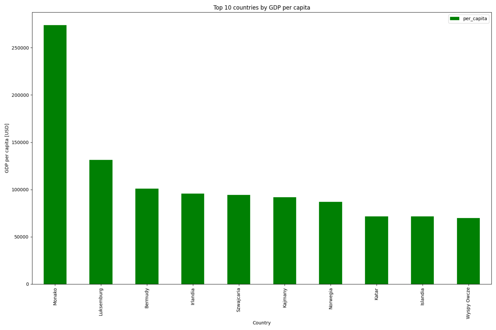

# Łączenie danych z różnych źródeł

## Wstęp

Produkt krajowy brutto (PKB) per capita to miara bogactwa narodowego,
która określa wartość wszystkich dóbr i usług wyprodukowanych w kraju
podzieloną przez liczbę mieszkańców.

PKB per capita jest używany jako miara do porównywania bogactwa narodowego
między różnymi krajami. Wysoki PKB per capita oznacza, że kraj jest bogaty,
podczas gdy niski PKB per capita oznacza, że kraj jest biedny.

## Zadanie

Stwórz zestawienie PKB per capita dla różnych krajów na podstawie danych
z serwisu Wikipedia. Stwórz wykres, który przedstawia PKB per capita dla
top 10 krajów.

## Dane

* https://en.wikipedia.org/wiki/List_of_countries_by_GDP_(nominal)
* https://en.wikipedia.org/wiki/List_of_countries_and_dependencies_by_population

## Algorytm

1. Pobierz dane z serwisu Wikipedia:
   * lista krajów według PKB (nominalnego),
   * lista krajów według populacji.
2. Połącz dane z obu list.
3. Stwórz zestawienie PKB per capita dla różnych krajów.
4. Stwórz wykres, który przedstawia PKB per capita dla top 10 krajów.
5. Zapisz wykres do pliku PNG.

## Przykład

